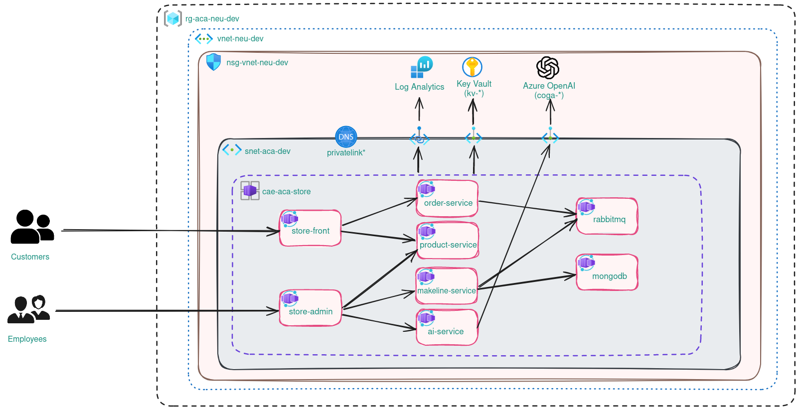

# Implementation of AKS Store Demo App with Azure Container Apps

This folder contains Bicep code for provisioning [aks-store-demo](https://github.com/Azure-Samples/aks-store-demo), but on Azure Container Apps. Deployment also is created in a manner that's closer to an actual production scenario, including security hardening configuration.

Below you may find the Azure solution architecture diagram:

Implementation includes following modules:

* [common](modules/common.bicep): includes common, shared resources that are used by other resources in the deployment. For example, managed identities or deployment-specific Azure Policy assignments.
* [network](modules/network.bicep): includes network-related resources. For example, virtual networks, subnets and network security groups.
* [dns](modules/dns.bicep): includes DNS-related resources. For example, private DNS zones.
* [vnet_links](modules/virtual-network-links.bicep): includes virtual network link resources for mapping of virtual networks with private DNS zones, which is required for the private endpoints to function properly.
* [kv](modules/keyvault.bicep): includes Azure Key Vault resources, with enabled RBAC and configuration for secure access to the resources with private endpoints.
* [azure_monitor](modules/azure-monitor.bicep): includes observability-related resources, like Log Analytics, Application Insights, etc. It also includes Azure Monitor Private Link Scope (AMPLS) and related resources for configuration of secure access to Azure Monitor services.
* [ai](modules/ai.bicep): includes cognitive services, like Azure OpenAI with respective model deployments and configuration for secure access to the resources with private endpoints.
* [aca_common](modules/aca-common.bicep): includes resources that are common for Azure Container Apps, like Azure Container Apps environment and network configuration for secure communication to and between apps.
* [internal_apps](modules/aca-internal-apps.bicep): includes container apps that are not publicly accessible, i.e. internal services.
* [public_apps](modules/aca-public-apps.bicep): includes container apps that are publicly accessible.

## Deployment instructions

Update Bicep parameter files in [parameters](parameters/) folder as per your use case. ***Please note that if you're changing the deployment region for Azure OpenAI service, you need to ensure that the region supports gpt-35-turbo deployment with up to 240 K quota.*** Please refer following Microsoft documentation for additional information: [Model summary table and region availability](https://learn.microsoft.com/en-us/azure/ai-services/openai/concepts/models#model-summary-table-and-region-availability).

Once you've verified parameter values you're ready to deploy resources. You can trigger deployment directly from your IDE (if you have Bicep extension installed), Azure CLI or by forking the repo and utilizing [deploy-aks-store-on-aca.yaml](../.github/workflows/deploy-aks-store-on-aca.yaml) GitHub Actions worfklow. Please note that you need to configure GitHub secrets for the workflow to be able to log into your Azure subscription and provision resources to it. I would recommend setting up a managed identity with federated credential for this purpose and give it Contributor permissions on the subscription level (resource group provisioning is part of the Bicep code, but you can also provision resource group outside of this deployment and then only give the identity permissions on the respective resource group's level).

Please refer following Microsoft documentation on how to set up managed identity with federated credentials for usage in GitHub Actions worfklow: [Use GitHub Actions to connect to Azure](https://learn.microsoft.com/en-us/azure/developer/github/connect-from-azure?tabs=azure-portal%2Clinux)
